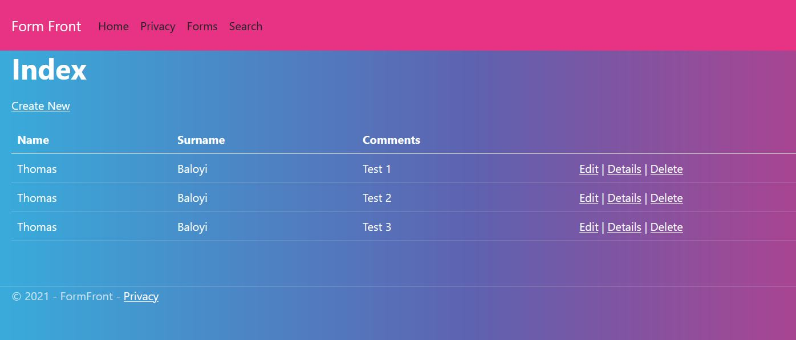

## Project: FormFront

## Description
A simple CRUD web application that collects information from users using forms. Users are required to login to perform some actions. The application is an ASP.Net MVC 5 (C#) project.

## Table of Contents
1. Installation
2. Running
3. Notes
4. Credit

## Installation
1. Download the repository.
2. Ensure you have Visual Studio 2019 installed.
3. Extract the repository and open the FormFront.sln file (using Visual Studio 2019).

## Running
1. Within Visual Studio 2019, click on the green "IIS Express" button or click CTRL + F5 on Windows
2. The application should navigate to your default browser.

## Notes
The application is still under development, some tasks to be implemented:
1. Improve the user experience.
2. Fix login issues.

## Credit
I used a Boostrap 5 theme from https://github.com/thomaspark/bootswatch.

## Snapshots

  

